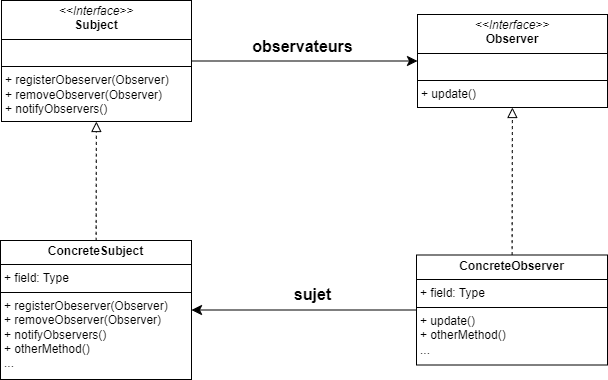

# Pattern Observer

Le pattern Observer est un modèle de conception qui définit une relation One-to-Many entre des objets, de manière à ce que lorsqu'un objet change d'état, tous les objets dépendants en sont informés et mis à jour automatiquement.

## Composant principaux

- *Subject* : L'objet qui partage son état est appelé `Subject`, il possède une liste d'observateur et les notifies lors des changements de sont état.  Dans l'exemple, c'est `WeatherData`.

- *Observer* : L'objet qui dépend du `Subject` est appelé `Observer`, il est notifié a chaque fois que l'état du sujet change. Dans l'exemple, c'est `CurrentConditionsDisplay`.

## Diagramme de classe

1. *Interface Subject* : Interface définissant les méthodes que tout sujet doit implémenter pour permettre l'enregistrement, le retrait et la notification des observateurs.

2. *Interface Observer* : Interface définissant la méthode update(), que les observateurs doivent implémenter pour recevoir les mises à jour du sujet.

3. *ConcreteSubject (WeatherData)* : Classe concrète qui implémente l'interface Subject. Elle maintient une liste d'observateurs et les notifie lorsque son état change.

4. *ConcreteObserver (CurrentConditionsDisplay)* : Classe concrète qui implémente l'interface Observer. Elle s'enregistre auprès d'un sujet pour recevoir des mises à jour et afficher les conditions actuelles.

